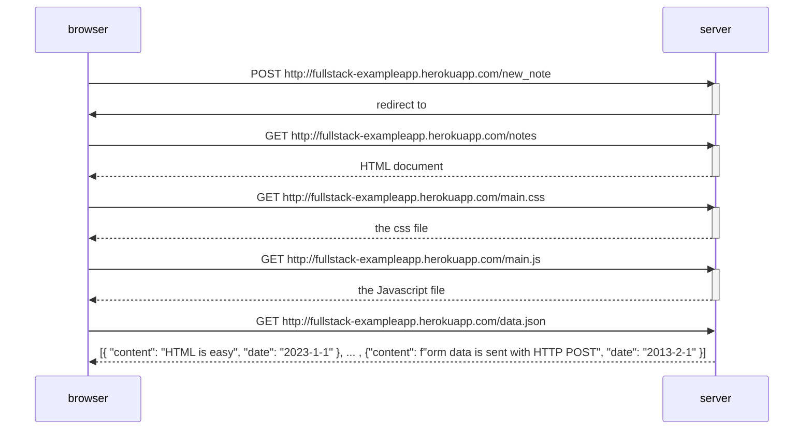

```mermaid
    sequenceDiagram
        participant browser
        participant server
        
        browser->>server: POST http://fullstack-exampleapp.herokuapp.com/new_note
        activate server
        server->>browser: redirect to 
        deactivate server
        
        browser->>server: GET http://fullstack-exampleapp.herokuapp.com/notes
        activate server
        server-->>browser: HTML document
        deactivate server
        
        browser->>server: GET http://fullstack-exampleapp.herokuapp.com/main.css
        activate server
        server-->>browser: the css file
        deactivate server
        
        browser->>server: GET http://fullstack-exampleapp.herokuapp.com/main.js
        activate server
        server-->>browser: the Javascript file
        deactivate server
        
        browser->>server: GET http://fullstack-exampleapp.herokuapp.com/data.json
        server-->>browser: [{ "content": "HTML is easy", "date": "2023-1-1" }, ... , {"content": f"orm data is sent with HTTP POST", "date": "2013-2-1" }]
```
